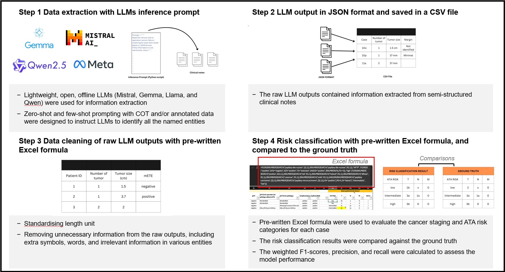

# Developing named entity framework for thyroid cancer staging and risk level classification using large language models
This page is to provide the technical details for the article "Developing named entity framework for thyroid cancer staging and risk level classification using large language models", which aims to provide a named-entitly framework about development of annotation guideline, conducting data annotation, ground-truth labelling, extraction disease information using open source Large Language Models (LLMs) by using different types of prompt strategies and classify ATA risk and AJCC 8<sup>th</sup> edition cancer staging using pre-written classification rules. The named-entity framework is evaluated by using different LLM strategies with ensemble-like majority voting approach.




# Table of contents
* [Requirement](#requirement)
  * [BRAT rapid annotation tool](#brat-rapid-annotation-tool)
  * [Ollama](#ollama)
  * [Large Language Models via Ollama](#large-language-models-via-ollama)
  * [Python libraries](#python-libraries)
* [Data source](#data-source)
* [Data annotation](#data-annotation)
* [Data extraction](#data-extraction)
* [Classification of risk and cancer staging](#classification-of-risk-and-cancer-staging)

## Requirement
### BRAT rapid annotation tool
Download and install BRAT rapid annotation tool (<a href="https://brat.nlplab.org/installation.html">link</a>).

### Ollama
Download and install Ollama according to your operation system (<a href="https://ollama.com/download">link</a>).

### Large Language Models via Ollama
The list of Ollama LLM models used in the study is listed in 'model_list.txt'.

Pull (download) the models you wish to use by running 'ollama pull' commands.

e.g.
```sh
ollama pull gemma2:9b-instruct-fp16
```


### Python libraries
Install the required python libraries through 'requirement.txt'.
```sh
pip install -r requirements.txt
```

## Data source
The operation records and pathology reports for 35 pseudo cases could be found in the folder "sample".

The TCGA pathology reports (50 for developing different prompting strategies and 289 for validation) could be found in the Genomic Data Commons data portal of National Cancer Institute (<a href="https://portal.gdc.cancer.gov/projects/TCGA-THCA">link</a>).

## Data Annotation
The annotation guideline was co-developed by endocrine surgeons and researchers, and could be found in the folder "annotation".

Data annotation was performed by two independent annotators, who have experiences in clinical research.
The annotation was conducted by using BRAT rapid annotation tool (<a href="https://brat.nlplab.org/">link</a>).

A step-by-step guide for data annotation is provided in the folder "annotation".

## Data extraction
The Python scripts for extraction of disease information from clinical notes could be found in the folder "scripts".

Eight prompting strategies have been proposed, and their corresponding file names of the script are as follow:
| Prompting strategies  | File name |
| ------------- | ------------- |
| Zero-shot prompting  | zeroshot.py  |
| COT prompting | cot.py |
| Few-shot prompting with all annotated data  | fewshot_all_data.py  |
| Few-shot prompting with non-repeated annotated data  | fewshot_trim_data.py  |
| Few-shot prompting with part of annotated data  | fewshot_part_data.py  |
| COT and few-shot prompting with all annotated data  | cot_fewshot_all_data.py  |
| COT and few-shot prompting with non-repeated annotated data  | cot_fewshot_trim_data.py  |
| COT and few-shot prompting with part of annotated data  | cot_fewshot_part_data.py  |

By default, Gemma 2 9B Instruct model is demonstrated in the scripts.

Any model could be chosen by changing the model name in the script file.
```sh
model = OllamaLLM(model="gemma2:9b-instruct-fp16",
...
```

To run the script (e.g. zero-shot prompting), simply run:
```sh
python zeroshot.py
```

After data extraction, a CSV file named 'output.csv' will be created in the resposity.

## Classification of risk and cancer staging
The templates of the pre-written classification rules could be found in the folder "classification".
After extraction of data, paste the data from the 'output.csv' to the sheet "Model output" to obtain the classification results in the sheet "Classification result".

Ensemble-like majority voting result is obtained for the final performance.

## Enquiry
For any enquiry, please contact the Laboratory of Data Discovery for Health (D²4H) (info@d24h.hk).
